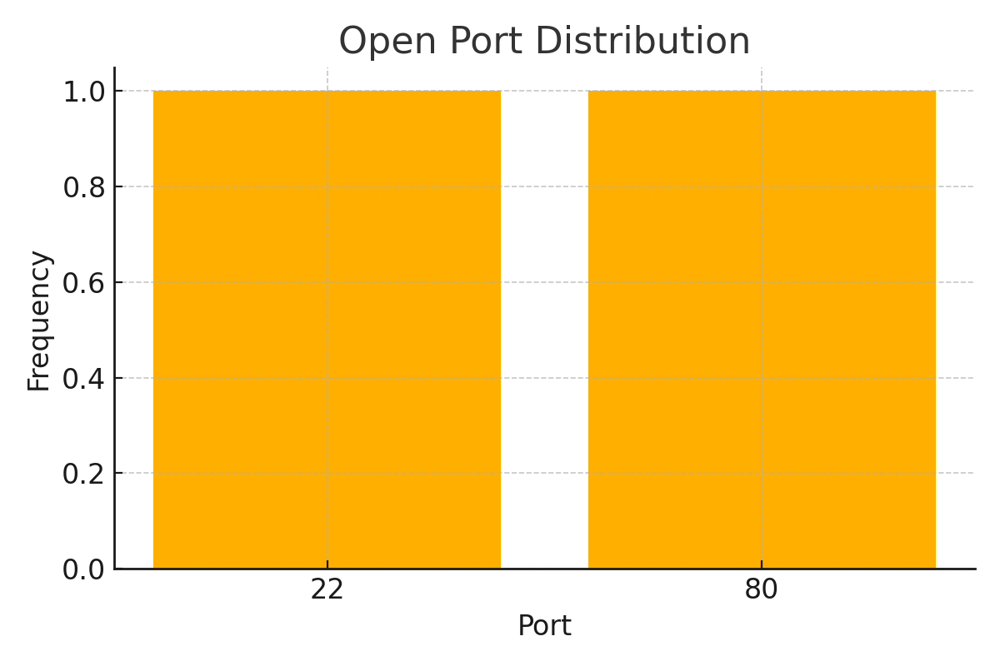

# NetScan Pro – Ethical Hacking Recon Scanner

NetScan Pro is a Python-based network scanning tool that identifies devices on a local network and scans for open ports. Inspired by tools like Nmap, it simulates real-world reconnaissance.

## 🔧 Features
- Detects active hosts in the subnet
- Port scanning on common ports
- CSV export of results
- Flask web UI for live viewing
- Chart of port frequency

## 📁 Files
- `netscan.py` – Scanner
- `webui.py` – Flask web viewer
- `results.csv` – Scan output
- `port_scan_chart.png` – Visualization
- `index.html` – Project write-up
- `README.md` – This file

## 🌍 Real-World Tools
- [Nmap](https://nmap.org)
- [Shodan](https://shodan.io)
- [Angry IP Scanner](https://angryip.org)

## 📊 Visualization


## 🚀 To Run Flask Web UI
```bash
python3 webui.py
```

Visit [http://localhost:5000](http://localhost:5000) to view results in a browser.

## ✅ What I Learned
I learned about network scanning, data export, visualization, error handling, and web integration.